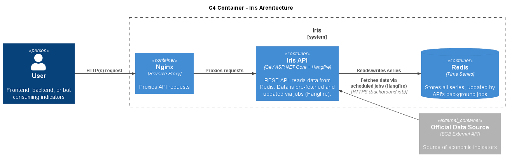
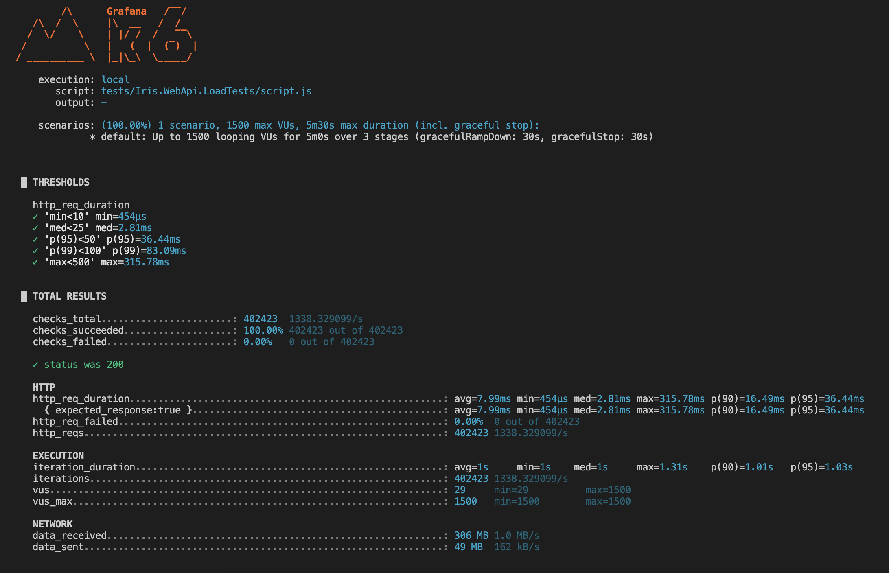

# Iris
Iris is a lightweight API designed to provide seamless, low latency access to official Brazilian economic indicators, including the Selic interest rate and IPCA inflation index.



## Local Setup
Use the following `make` commands:
```
=============================
Available commands:
=============================
down                      Stop containers
up                        Setup containers
```

## Contributing
Contributions are welcome!
Open issues for bugs, questions, or suggestions.
Submit pull requests with new resources or improvements.

## Further Results

Once Redis was fully populated, a load test was performed and metrics collected using k6:

