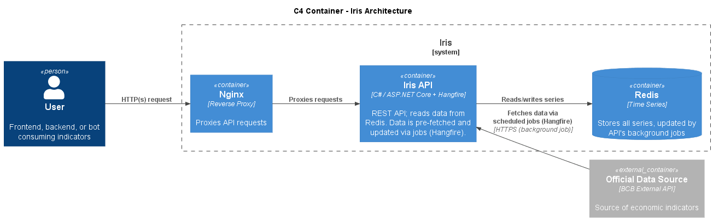
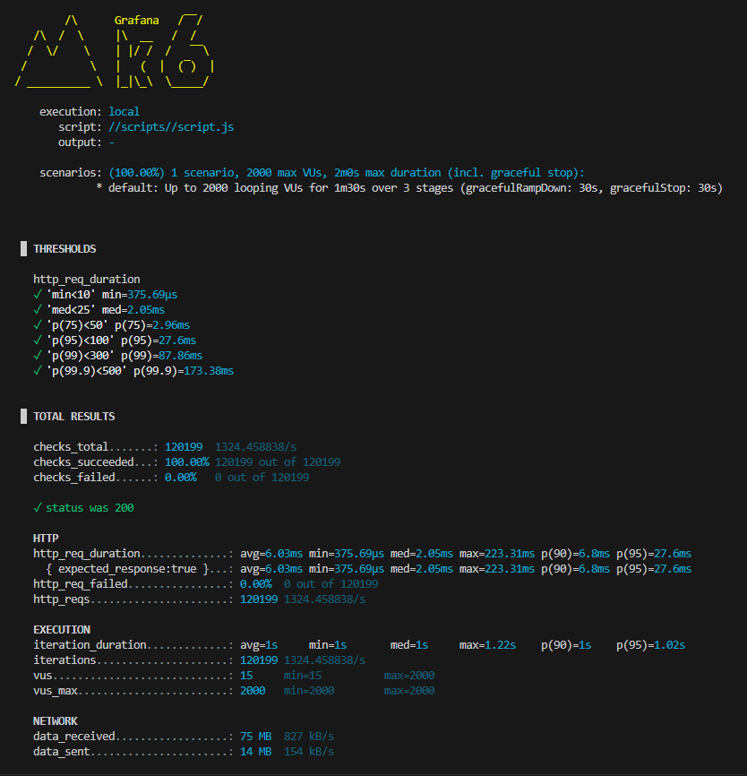

# Iris
Iris is a lightweight API designed to provide seamless, low latency access to official Brazilian economic indicators, including the Selic interest rate and IPCA inflation index.



## Local Setup
Use the following `make` commands:
```
=============================
Available commands:
=============================
down                      Stop containers
load                      Run load test
up                        Setup containers
```

### Telemetry

Distributed Tracing (Tempo):
- HTTP request/response traces
- Redis command execution spans
- External HTTP client traces (BCB API)
- Background job execution flows

Metrics (Prometheus):
- `http_server_request_duration_seconds` - Latency histograms
- `http_server_request_total` - Request counters by status
- `process_runtime_dotnet_gc_collections_total` - GC performance

Structured Logging (Loki):
- JSON-formatted log output
- Correlation IDs for trace-log linking
- Severity-based filtering

### Query Examples

TraceQL - Latency analysis:
```
{service.name="iris-api"} | duration > 500ms
```

LogQL - Error correlation:
```
{service_name="iris-api"} |= "Error" | json | line_format "{{.message}}"
```

PromQL - Throughput calculation:
```promql
sum(rate(http_server_request_duration_seconds_count[5m])) by (http_route)
```

## Contributing
Contributions are welcome! Open issues for bugs, questions, or suggestions. Submit pull requests with new resources or improvements.

## Further Results
After fully populating Redis, a load test was executed using k6. The results demonstrate consistent low response times and stable throughput under proposed concurrency.

